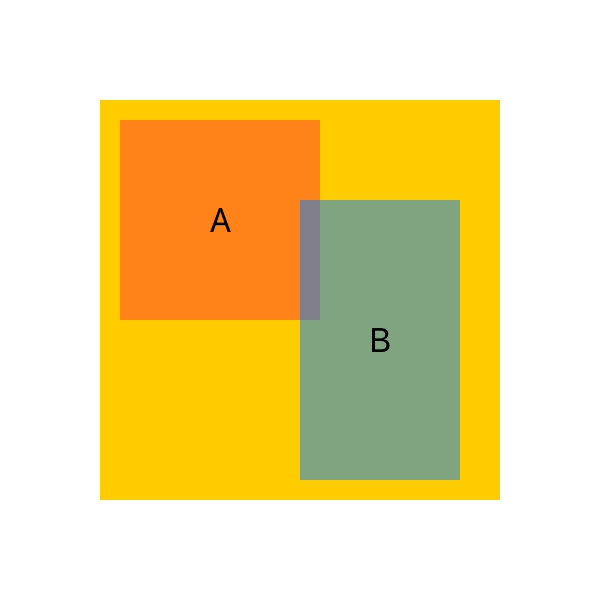

# FrameLayoutView

`FrameLayoutView` makes it possible to layout SwiftUI `View`s with `CGRect` frames. 



```swift
FrameLayoutView(size: CGSize(width: 200, height: 200), items: [
    .init(Text("A"), frame: CGRect(x: 10, y: 10, width: 100, height: 100)) { view in
        view.background(Color.red.opacity(0.5))
    },
    .init(Text("B"), frame: CGRect(x: 100, y: 50, width: 80, height: 140)) { view in
        view.background(Color.blue.opacity(0.5))
    }
])
    .background(Color.yellow)
```
